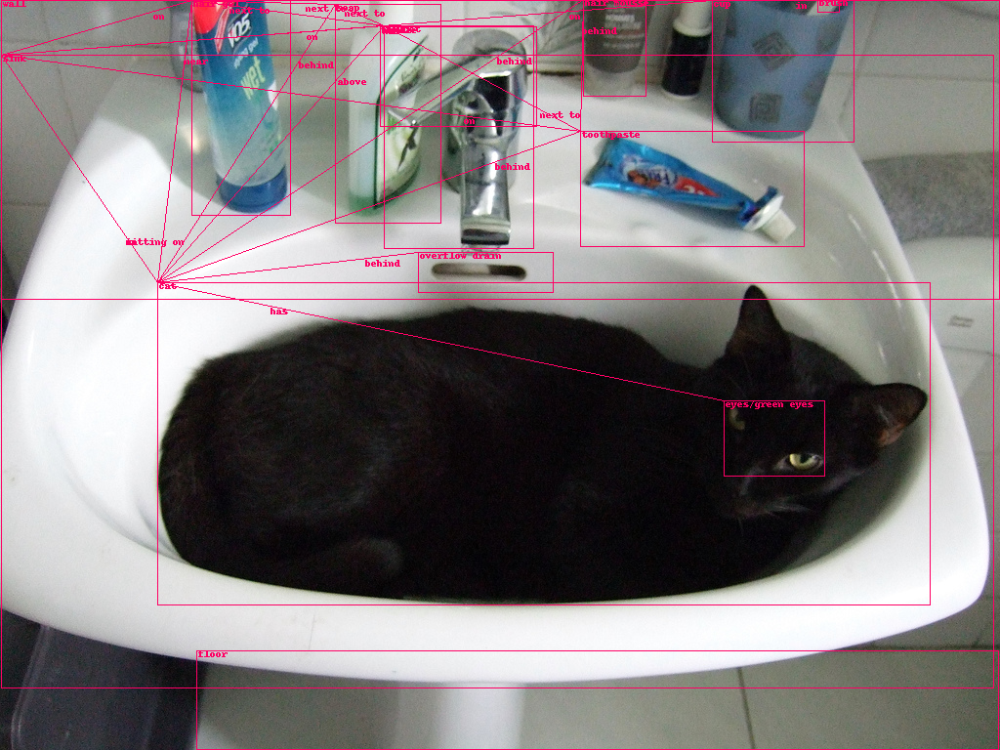

# Object Relationship Detection

The goal is to find relationships between objects in an image. Most approaches break the problem into object detection from an image and relationship classification from representations of pairs of detected objects. To detect objects, CNN architectures like R-CNN, YOLO, SSD, PANet are used. Given a set of detected objects, relationships are culled or classified, using RL or RNNs. Lack of exhaustive object and relationship annotations in datasets result in false positives according to the data. Due to lack of thorough annotations, recall at top-K predictions is used to measure the performance of object-relationship detection systems.

